#### **Документация к проекту "Телеграм-бот для сбора обратной связи и контроля уровня обслуживания"**
**Цель проекта** - создание и внедрение удобного, простого и эффективного инструмента для сбора и обработки обратной связи от пользователей (механиков и сервисных консультантов) системы «Умный Гараж» (УмГар). Проект направлен на сокращение времени реакции на проблемы и повышение качества обратной связи.
Проект представляет собой разработку бота для мессенджеров, который будет выступать в качестве основного интерфейса для взаимодействия с пользователями. 
Архитектура должна позволять добавление новых мессенджеров через создание коннекторов, связывающих конкретный мессенджер с основным модулем.

##### Репозитории разработки
- [Основной модуль](https://github.com/ZeneZ0/Support_Bot_IST)
- [Коннектор VK](https://github.com/QUwerty1/vk-bot-adapter)
- [Коннектор TG](https://github.com/Svolum/connector)

##### Сбор обращений
Пользователь может сообщить о проблеме как написав боту в личные сообщения, так и через группу.
Бот должен собирать следующую необходимую информацию у пользователя:
- **Категория**. Пользователь сможет выбрать тип проблемы (из представленного списка).
- **Критичность** (из представленного списка).
- **Программное обеспечение**, в котором возникла проблема (из представленного списка).
- **Описание проблемы** (если заявитель на данном этапе, бот ожидает новое сообщение с текстом проблемы).
- **Изображения** (опционально для создания обращения). Пользователь может отправить изображения как в отдельных сообщениях, так и в одном. Бот ожидает изображения только если пользователь находится на данном этапе.

Процесс заполнения не привязан к последовательности. Пользователь свободно перемещается между шагами, получает визуальное подтверждение введенных данных и может прервать создание обращения.
Техподдержка может создавать обращения и связываться с заявителями для уточнения деталей.

##### Присоединение к обращениям
Система предлагает присоединиться к существующим нерешенным проблемам перед созданием новой заявки. Бот выводит все актуальные обращения для выбора. Это позволит снизить количество дубликатов и экономит время заявителей для получения решения его проблемы, поскольку часто проблемы носят общий характер.

##### Интеграция бота в чаты мессенджеров
Пользователи добавляют бота в рабочие чаты, при этом основной чат техподдержки остается единым. Все обращения автоматически пересылаются в специальную группу поддержки.

##### Решение проблемы
Пользователь, оставивший обращение/присоединившийся к обращению, должен получить решение. Как в личные сообщения, так и в группы, куда был добавлен бот. 
Сотрудник техподдержки должен закрыть обращение, выбрав статус и написав текст решения. Обращение можно закрыть только один раз. Взаимодействовать с обращениями могут все участники чата группы техподдержки (принимать и закрывать). Может быть такое, что принимает один сотрудник, закрывает другой.

##### Хранение и аналитика
Все заявки, их статус, время реакции и решения будут храниться в базе данных. Это позволит проводить аналитику в разрезе категорий и ПО.
Задача будет считаться приоритетной для поддержки, если пользователь опишет проблему в полной и понятной форме.

##### Контроль SLA
Установить стандарты по времени первой реакции и времени решения проблемы, чтобы обеспечить качественное обслуживание пользователей. В случае, если пользователь не получит ответ от поддержки в определённый срок, проблема должна перейти к другому более компетентному сотруднику - в планах это реализовать.

##### Схема использования системы пользователями:
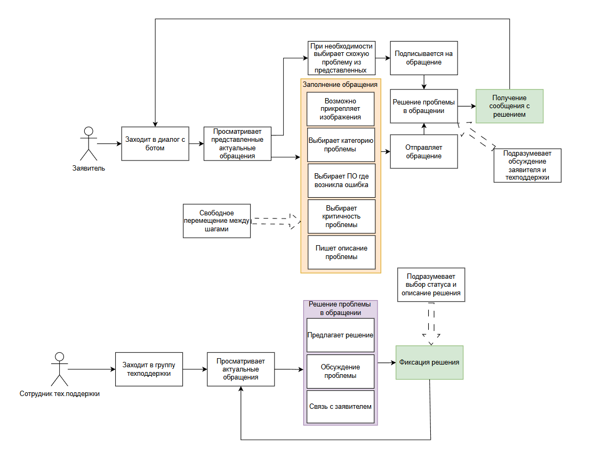

##### Use cases:
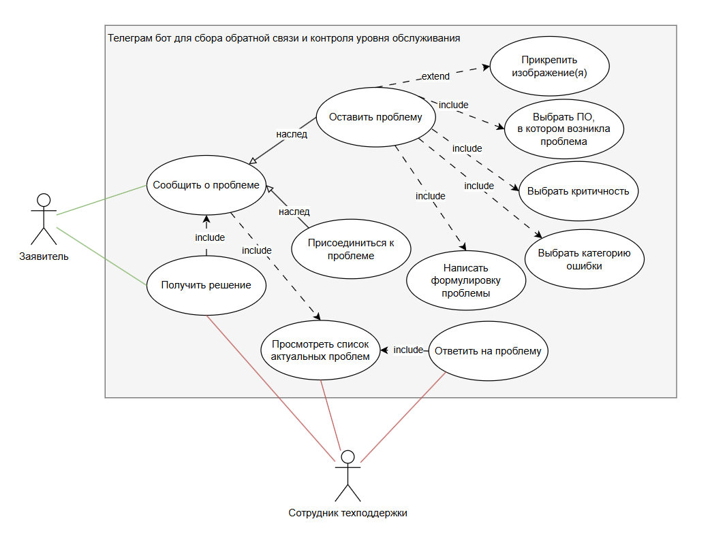

##### Общая архитектура:
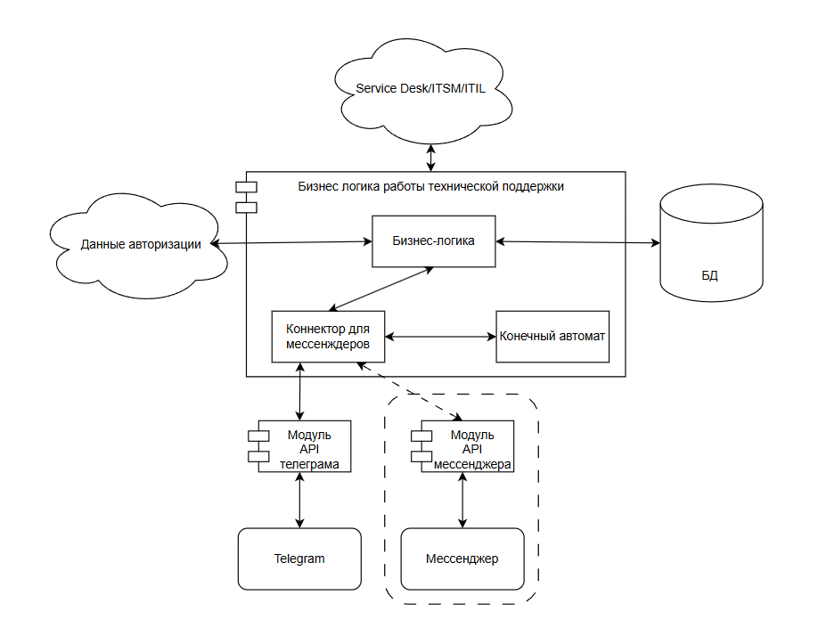

##### Взаимодействие модулей - коннектора (API), бизнес-логика - модуль AI агента, кнопка ниже кликабельна:
 
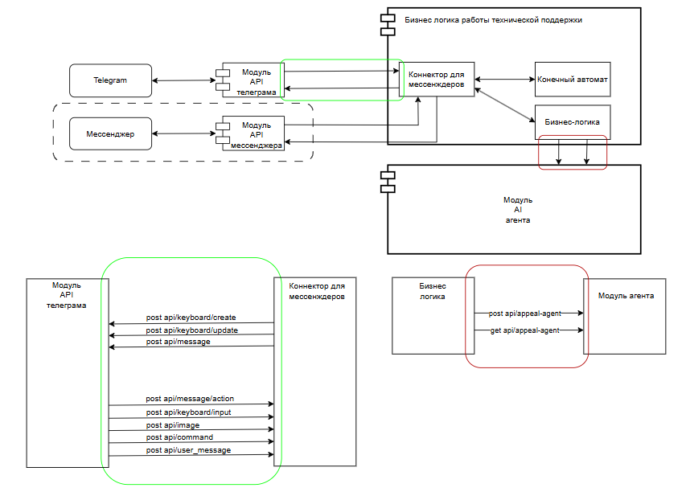

##### Архитектура в нотации C4
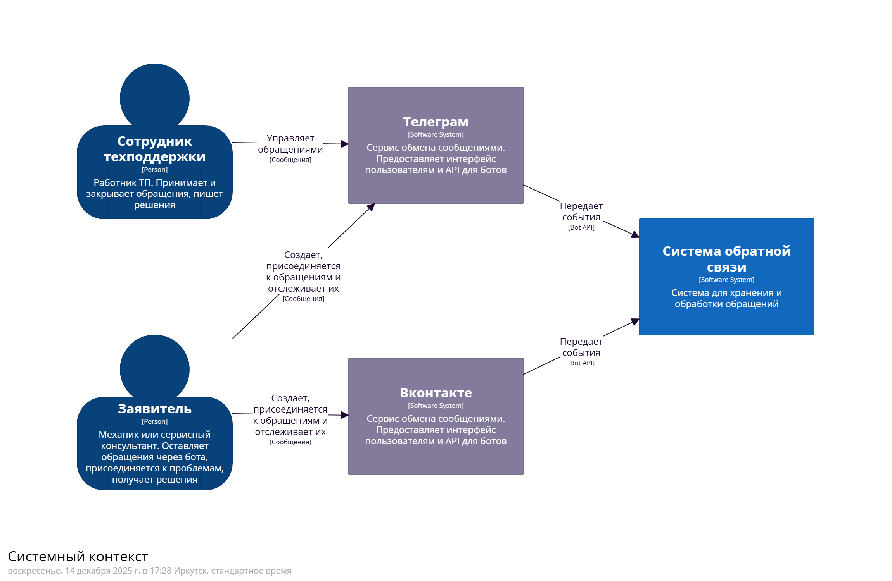
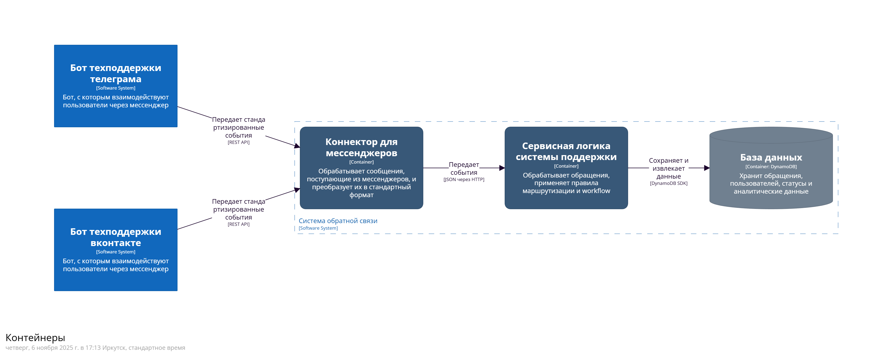
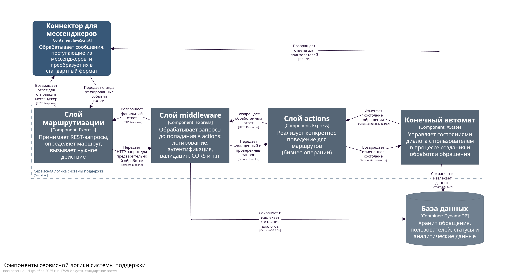

##### Машина состояний тех. поддержки
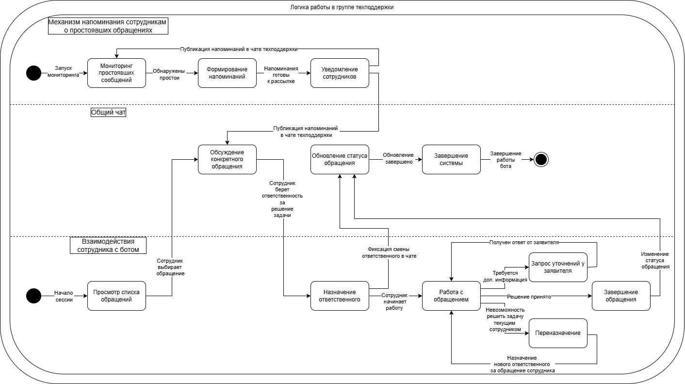

##### Создание клавиатуры:
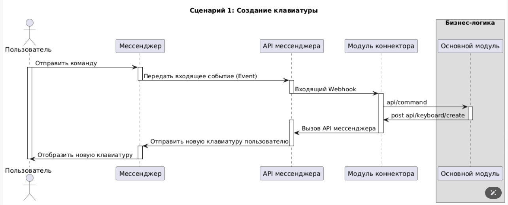

##### Нажатие на кнопку:
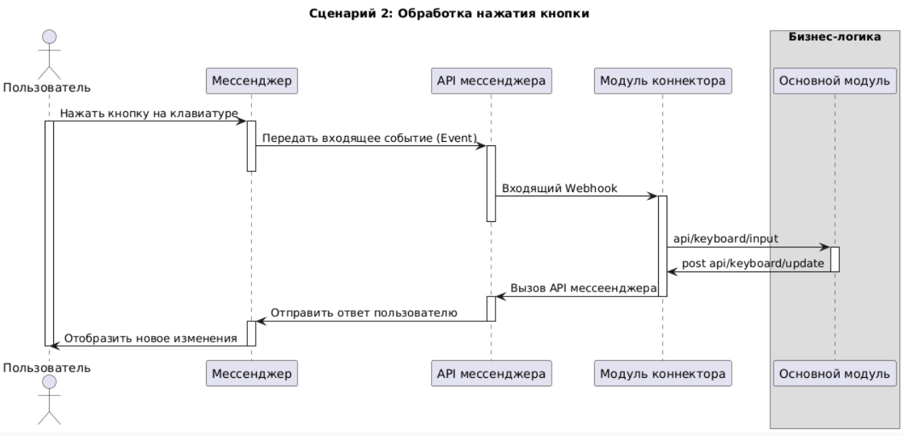

##### Создание запроса:
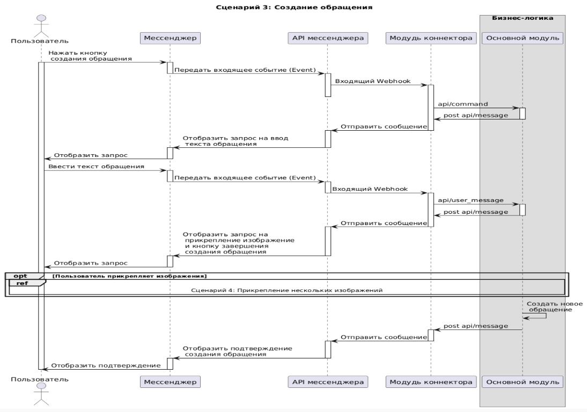

##### Прикрепление изображения:
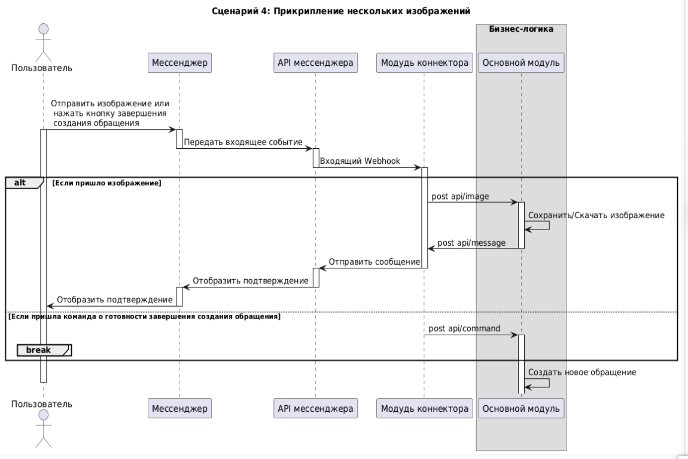

##### Словарь предметной области
| №                                           | Сущность                         | Английский эквивалент          | Описание                                                                                                                                      |
| ------------------------------------------- | -------------------------------- | ------------------------------ | --------------------------------------------------------------------------------------------------------------------------------------------- |
| I. Основные Бизнес-Сущности                 |                                  |                                |                                                                                                                                               |
| 1                                           | Обращение                        | (Appeal)                       | Тикет от пользователя, требующий решения.                                                 |
| 2                                           | Решение                          | (Solution)                     | Детальное описание действий, предпринятых для устранения проблемы по обращению.                      |
| 3                                           | Пользователь                     | (User)                         | Лицо, создавшее обращение.                                                                        |
| 4                                           | Изображения                      | (Image)                        | Прикрепленные файлы, которые помогают лучше понять проблему пользователя.                         |
| 5                                           | Текст обращения                  | (Text_of_the_appeal)           | Основное текстовое описание проблемы, предоставленное пользователем.                                                                           |                                                                                                                                    |
| 6                                           | Статус                           | (Appeal_status)                       | Текущее состояние запроса в процессе работы.                                                       |
| 7                                           | Категория                        | (Appeal_category)                     | Классификация проблемы.                               |
| 8                                           | ПО                               | (Appeal_software)                     | Программное обеспечение, с которым связана возникшая проблема.                                                                                |
| 9                                           | Критичность                      | (Appeal_criticality)                  | Степень влияния проблемы на работу.                                                      |
| 10                                          | Подразделение                    | (Appeal_subdivision)                  | Отдел, от которого пришла проблема.                                                |
| II. Роли и Отношения                        |                                  |                                |                                                                                                                                               |
| 11                                          | Роль                             | (User_role)                         | Назначенная функция пользователя в системе.                                        |
| 12                                          | Отношение пользователя к обращению | (User_relation_to_appeal) | Описывает какую роль в конкретном обращении занимает пользователь.                                    |
| 13                                          | Наименование отношения           | (Name_of_the_relation)     | Тип роли пользователя по отношению к конкретному обращению.                           |
| III. Технические и Коммуникационные Элементы|                                  |                                |                                                                                                                                               |
| 14                                          | API мессенджера                  | (Messenger API)                | Интерфейс, предоставляемый самой платформой — например, Telegram, который позволяет Модулю коннектора принимать входящие события и отправлять ответы. |
| 15                                          | Мессенджер                       | (Messenger)                    | Канал связи, через который был создан запрос.                                                            |
| 16                                          | Связь с пользователем            | (Communication_with_user)     | Хранит информацию о том, как конкретный пользователь связан с конкретным мессенджером.                        |
| 17                                          | Команда                          | (Instruction)                      | Сообщение от пользователя (обычно начинается с /), которое вызывает определенный сценарий или функцию в системе.           |
| 18                                          | Клавиатура                       | (Keyboard)                     | Набор интерактивных кнопок, отображаемых в интерфейсе мессенджера для упрощения ввода команд и выбора параметров.                             |
| 19                                          | Кнопка                           | (Button)                       | Интерактивный элемент клавиатуры, при нажатии которого генерируется событие для системы.                                                      |
| 20                                          | Личные сообщения                 | (Personal_messages)            | Личный чат с одним пользователем, в котором будут обсуждаться проблемы «Один на один».                                                                            |
| 21                                          | Группа                           | (Group_messages)                        | Групповой чат с множеством пользователей со схожей проблемой.                                  |
| 22                                          | Присоединение к обращению         | (Joining_the_appeal)          | Действие, позволяющее другому пользователю со схожей проблемой получить доступ к обращению и стать его наблюдателем. |
| 23                                          | Подразделение-заявитель         | (Subdivision-applicant)          | Подразделение, в котором возникла проблема.  |
| IV. Архитектурные Модули                    |                                  |                                |                                                                                                                                               |
| 24                                          | Основной модуль                  | (Main_module)                  | Центральный компонент системы, содержащий бизнес-логику.                      |
| 25                                          | Модуль коннектора                | (Connector_module)             | Технический компонент, отвечающий за прием, перевод и отправку сообщений между API мессенджера и основным модулем системы.                    |
| 26                                          | Модуль конечного автомата        | (Finite_state_machine_module)  | Технический компонент, отвечающий за управление переходами обращения между различными статусами.        |

##### Словарь статусов
| № | Статус                           | Английский эквивалент  | Расшифровка статуса                                                                                                                  |
| - | -------------------------------- | ---------------------- | ------------------------------------------------------------------------------------------------------------------------------------ |
| 1 | Новый                            | (Created)              | Обращение только что создано пользователем в системе, ему присвоен уникальный номер. Ожидает первичного просмотра.                   |
| 2 | Прочитан                         | (Viewed)               | Обращение просмотрено оператором, но активная работа по решению проблемы еще не начата.                                              |
| 3 | В работе                         | (In_progress)          | Ответственный исполнитель активно занимается решением проблемы.                                                                      |
| 4 | Ожидает ответа стороннего отдела | (Waiting_for_external) | Работа над обращением приостановлена, так как требуется помощь или информация от другого отдела, не являющегося прямым исполнителем. |
| 5 | Решено                           | (Decided)              | Исполнитель считает проблему устраненной и отправил пользователю отчет о решении.                                                    |
| 6 | Закрыт                           | (Closed)               | Обращение окончательно завершено. Дальнейшие действия по этому тикету не требуются.                                                  |

##### Словарь наименований отношений
| №     | Наименование отношения        |Английский эквивалент  |Расшифровка наименования                                                                                                                                 |
|--------------------------------|----------------------------------|------------------------------------|-----------------------------------------------------------------------------------|
| 1     |Заявитель      |(Applicant)    |Пользователь, который фактически создал данное обращение в системе.                                                                                             |
| 2     |Принявший сотрудник|   (Accepter_employee)     |Сотрудник техподдержки, который первым принял обращение в работу (перевел в статус "В работе").                                                                                       |
| 3 |Закрывший сотрудник        |(Closer_employee)|     Сотрудник техподдержки, который зафиксировал решение и закрыл обращение (перевел в статус "Закрыт"). |
| 4 |Подписчик  |(Subscriber)|  Пользователь, который присоединился к обращению через функционал "Присоединение к проблеме". У него схожая проблема, и он будет уведомлен о финальном решении. |

##### Словарь наименований критичностей
| №     | Наименование кртичности       |Английский эквивалент  |Расшифровка наименования                                                                                                                                 |
|--------------------------------|----------------------------------|------------------------------------|-----------------------------------------------------------------------------------|
| 1     |Не проблема    |(No_problem)   | Проблема не влияет на работу и не требует срочного вмешательства.                                                                                             |
| 2     |Проблема|      (Problem)       |Проблема, требующая внимания, но не критичная для работы.                                                                                       |
| 3 |Блокирующая проблема       |(Blocking_problem)|    Проблема, которая полностью блокирует работу пользователя или системы и требует немедленного решения. |

##### Словарь категорий обращений
| №     | Наименование категории        |Английский эквивалент  |Расшифровка категории                                                                                                                                 |
|--------------------------------|----------------------------------|------------------------------------|-----------------------------------------------------------------------------------|
| 1     |Техническая ошибка     |(Technical_bug)        |Сбой, непредвиденное поведение или некорректная работа ПО/оборудования.                                                                                             |
| 2     |Консультация|  (Consultation)  |Вопрос по использованию, настройке или функционалу системы.                                                                                       |
| 3 |Проблема с доступом        |(Access_issue)|Проблемы с логином, паролем, правами доступа. |

##### Словарь классификаций сообщений
| №  | Название классификации    | Английский эквивалент    | Роль            | Состояние машины, к которому относится данное сообщение |
|----|---------------------------|--------------------------|-----------------|----------------------------------------------------------|
| 1  | Приветствие               | (Greeting)               | Пользователь    | `welcome`                                                |
| 2  | Навигация                 | (Navigation)             | Пользователь    | `listAppeals`, `specificAppeal`                          |
| 3  | Описание проблемы         | (Problem_description)    | Пользователь    | `waitingDescription`                                     |
| 4  | Выбор категории           | (Category_selection)     | Пользователь    | `chooseCategory`                                         |
| 5  | Указание ПО               | (Software_name)          | Пользователь    | `waitingSoftware`                                        |
| 6  | Задание критичности       | (Criticality_level)      | Пользователь    | `waitingCriticality`                                     |
| 7  | Прикрепление файла        | (File_attachment)        | Пользователь    | `waitingAttachments`                                     |
| 8  | Подтверждение             | (Confirm)                | Пользователь    | `fixationAppeal`                                         |
| 9  | Отмена                    | (Cancel)                 | Пользователь    | `cancelled`                                              |
| 10 | Ответ сотрудника          | (Support_reply)          | Сотрудник       | `Solving`                                                |
| 11 | Действие сотрудника       | (Staff_action)           | Сотрудник       | `Created`, `In_progress`                                 |
| 12 | Нераспознанное сообщение  | (Unrecognized)           | Любая           | Любое состояние вне перечисленных выше                   |

##### Словарь состояний машины
| №  | Состояние           | Машина              | Описание                                                                                          |
|----|---------------------|---------------------|---------------------------------------------------------------------------------------------------|
| I. appealRoot (Корневая машина пользователя) |  |  |                                                                                                   |
| 1  | `welcome`           | appealRoot          | Начальное состояние. Бот приветствует пользователя и предлагает создать или просмотреть обращения.|
| 2  | `listAppeals`       | appealRoot          | Отображение списка актуальных обращений для выбора или создания нового.                           |
| 3  | `specificAppeal`    | appealRoot          | Просмотр карточки конкретного обращения. Доступно присоединение к нему.                           |
| 4  | `joinMaster`        | appealRoot          | Запуск дочерней машины присоединения к обращению (appealMenu).                                    |
| 5  | `createAppeal`      | appealRoot          | Запуск дочерней машины создания обращения (appealCreate).                                         |
| II. appealCreate (Машина создания обращения) |  |  |                                                                                                   |
| 6  | `manageAppeal`      | appealCreate        | Главное меню создания. Отображает прогресс заполнения и кнопки выбора полей.                      |
| 7  | `waitingDescription`| appealCreate        | Ожидает текстовое описание проблемы от пользователя.                                              |
| 8  | `chooseCategory`    | appealCreate        | Ожидает выбор или ввод категории обращения.                                                       |
| 9  | `waitingSoftware`   | appealCreate        | Ожидает название программного обеспечения, с которым связана проблема.                            |
| 10 | `waitingCriticality`| appealCreate        | Ожидает выбор уровня критичности проблемы.                                                        |
| 11 | `waitingAttachments`| appealCreate        | Ожидает прикрепление изображений. Принимает несколько файлов подряд.                              |
| 12 | `fixationAppeal`    | appealCreate        | Предпросмотр заполненного обращения. Ожидает подтверждения или отмены.                            |
| 13 | `savingAppeal`      | appealCreate        | Асинхронное сохранение обращения в базу данных.                                                   |
| 14 | `created`           | appealCreate        | Финальное состояние. Обращение успешно создано и зарегистрировано в системе.                      |
| 15 | `cancelled`         | appealCreate        | Финальное состояние. Создание обращения отменено пользователем.                                   |
| III. appealMenu (Машина присоединения к обращению) |  |  |                                                                                                   |
| 16 | `confirmJoin`       | appealMenu          | Запрашивает у пользователя подтверждение присоединения к выбранному обращению.                    |
| 17 | `registerJoin`      | appealMenu          | Финальное состояние. Пользователь зарегистрирован как подписчик обращения.                        |
| 18 | `cancelJoinProcess` | appealMenu          | Финальное состояние. Присоединение отменено, возврат к списку обращений.                          |
| IV. supportAppeal (Машина сотрудника техподдержки) |  |  |                                                                                                   |
| 19 | `Created`           | supportAppeal       | Обращение только что поступило. Ожидает принятия в работу сотрудником.                            |
| 20 | `In_progress`       | supportAppeal       | Обращение принято в работу. Доступны переназначение, возврат в очередь или переход к решению.     |
| 21 | `Solving`           | supportAppeal       | Сотрудник вводит текст решения. Ожидает отправки или отмены.                                      |
| 22 | `Closed`            | supportAppeal       | Финальное состояние. Обращение закрыто, решение зафиксировано и отправлено заявителю.             |

##### Модели данных
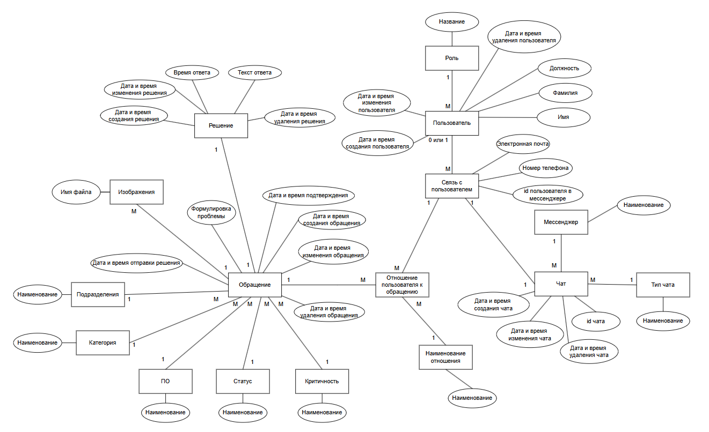

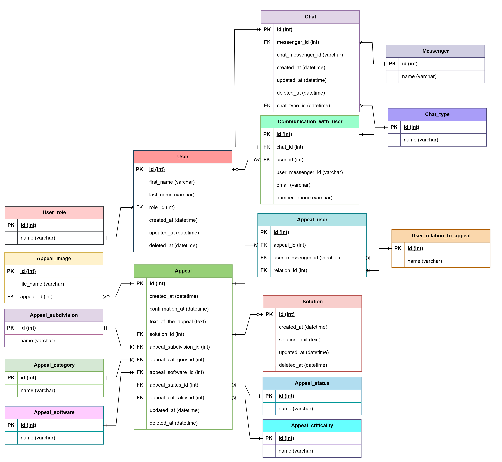

